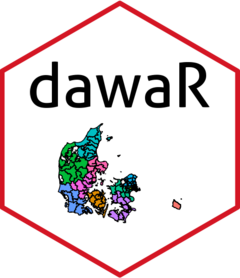

<!-- README.md is generated from README.Rmd. Please edit that file -->

# dawaR <a href="https://dawar.aleksanderbl.dk/"></a>

<!-- badges: start -->

[](https://CRAN.R-project.org/package=dawaR)
[](https://aleksanderbl29.r-universe.dev/dawaR)
[](https://github.com/aleksanderbl29/dawaR/actions/workflows/R-CMD-check.yaml)
[](https://app.codecov.io/gh/aleksanderbl29/dawaR)
[](https://www.repostatus.org/#active)
<!-- badges: end -->

The goal of `{dawaR}` is to make access to the Danish Web Address API
convenient for many more users.

## Installation

You can install `{dawaR}` from CRAN with:

``` r
install.packages("dawaR")
```

Or you can install the latest pre-release version of `{dawaR}` from
r-universe with:

``` r
install.packages(
  "dawaR",
  repos = c(
    aleksanderbl29 = "https://aleksanderbl29.r-universe.dev",
    getOption("repos")
  )
)
```

You can install the latest development version of `{dawaR}` from
[GitHub](https://github.com/aleksanderbl29/dawaR) with:

``` r
# install.packages("devtools")
devtools::install_github("aleksanderbl29/dawaR")
```

If you install the package in an environment configured with
[`renv`](https://rstudio.github.io/renv/index.html) on MacOS, please
consult `vignette("renv-issues")` to ensure that `get_map_data()` works
as intended.

## Usage

Be sure to see the [getting
started](https://dawar.aleksanderbl.dk/articles/dawaR.html) and the
[guide on how to make maps with
{dawaR}](https://dawar.aleksanderbl.dk/articles/printing_maps.html).

## DAWA *will* be phased out

The government entity that maintains the Danish Web Address API has
disclosed that the API will be phased out at some point. When that time
comes, this package will become deprecated and I will have another
package ready to provide the same functionality. The service that is to
replace DAWA is called Datafordeleren (The Data Distribution) and is in
the works. Some functionality in relation to The Central Register of
Buildings (BBR) has already been moved to the new service.

If you know how to read danish (or use machine-translation) you can keep
yourself up to date on [this
page](https://dataforsyningen.dk/data/4924).

But no worries! It does not sound like the shutdown of DAWA will happen
anytime soon or without due notice. You can read more about this and
read the history of updates in `vignette("status")`. Any minor updates
will be shown there. Major ones will be on this page. Both will be
communicated with `lifecycle` in the functions.
